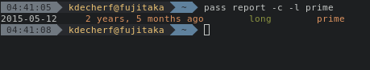

# pass-report

A [pass](https://www.passwordstore.org) extension that reports age and length of
passwords.



## Description

`pass report` shows the date and age of the last change of a set of passwords.
It can also shows an indication of their length, inspired by an [ANSSI
article](https://www.ssi.gouv.fr/administration/precautions-elementaires/calculer-la-force-dun-mot-de-passe/)
(_french_).

This tool uses `git blame` and `git show` to find the last commit editing the
first line of a password, thus ignoring renames and reencrypts.

**Note:** this extension may take a long time to show data for all passwords as
it needs to decrypt each of them.

This extension and the configuration were inspired by [this
thread](https://lists.zx2c4.com/pipermail/password-store/2015-July/001638.html).

## Usage

```
Usage:
      pass report [-c|--color] [-l|--length] [<password file>]
            Report last change's date and age of all passwords or given
            password

         Options:
            -c, --color    Show old password (more than 2 years) in yellow
            -l, --length   Show password length indication
            -h, --help     Show this help

         Password length indication:
            very short     Less than 8 characters
            short          Less than 13 characters
            medium         Less than 17 characters
            long           17 characters or more
```

## Installation

### Requirements

* `pass 1.7.0` or greater
* Your store must use git

#### Git and GPG

You must configure git in order to handle `.gpg` files with `git blame` and `git
show`:

``` gitconfig
[diff "gpg"]
   textconv = gpg --no-tty --decrypt --quiet
[blame "gpg"]
   textconv = gpg --no-tty --decrypt --quiet
```

### Installation from source

``` bash
git clone https://github.com/Kdecherf/pass-report
cd pass-report
sudo make install
```

### Exherbo

``` bash
cave resolve pass-report -x1
```
